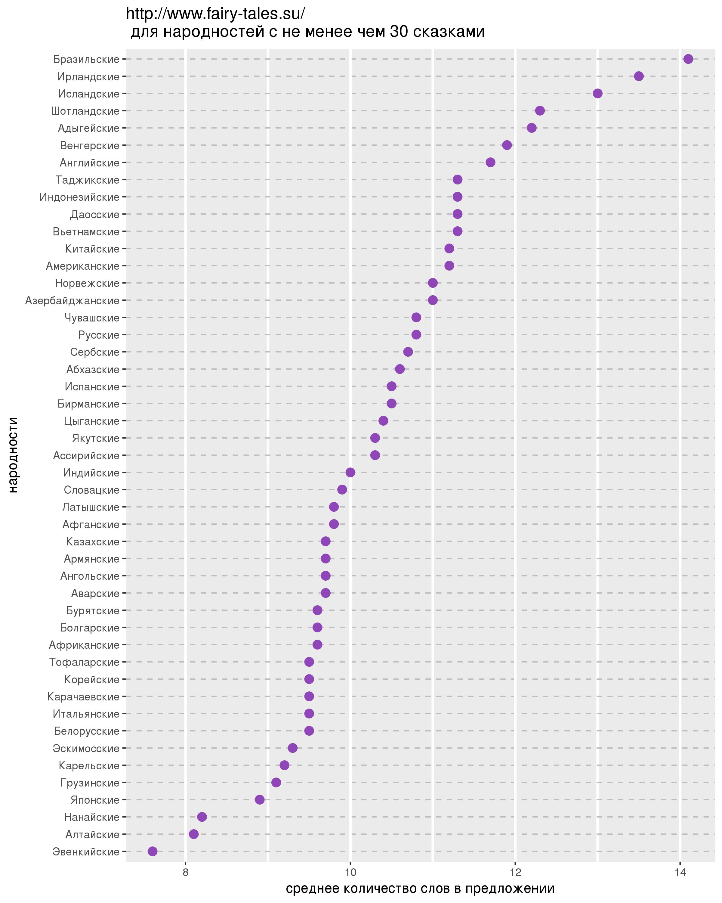
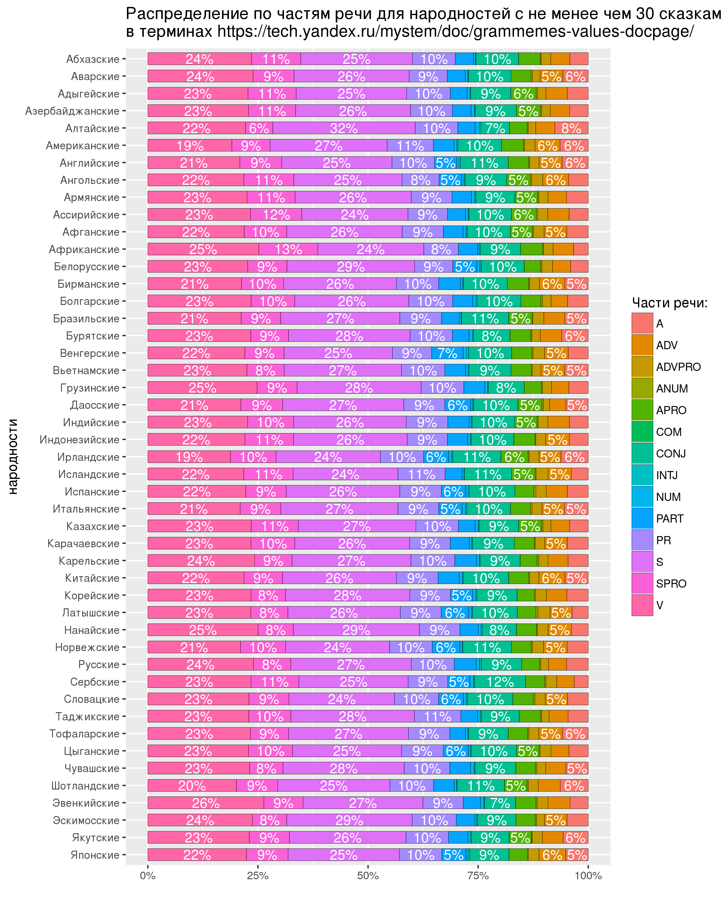

# hse-tales-project

## Игра
В игре нужно угадать народность по преъявляемым n-граммам (последовательности из n слов) из текстов ее сказок.
Поиск осуществляется по лемматизированным текстам, но предъявляются нелемматизированные n-граммы.
Лемматизация идет на ходу, поэтому приходится ждать, если выбраны народности с большим числом текстов.
Источник сказок: [http://www.fairy-tales.su/](http://www.fairy-tales.su/)

**Как запустить?** 
*вариант 1. со скачиванием:* `tales-loader.py` ➜ ожидать около получаса ➜`tales-game.py` 

*вариант 2. с папкой texts-in-subdirs на диске* `tales-game.py`

### График 1 :crystal_ball:

`sentence-length.py` ➜ создастся `sentence-length.csv` ➜ `sentence-length.R` ➜ создастся `sentence-length.png`

## График 2

`part-of-speech.py` ➜ создастся `part-of-speech.csv` ➜ `part-of-speech.R` ➜ создастся `part-of-speech.png`

